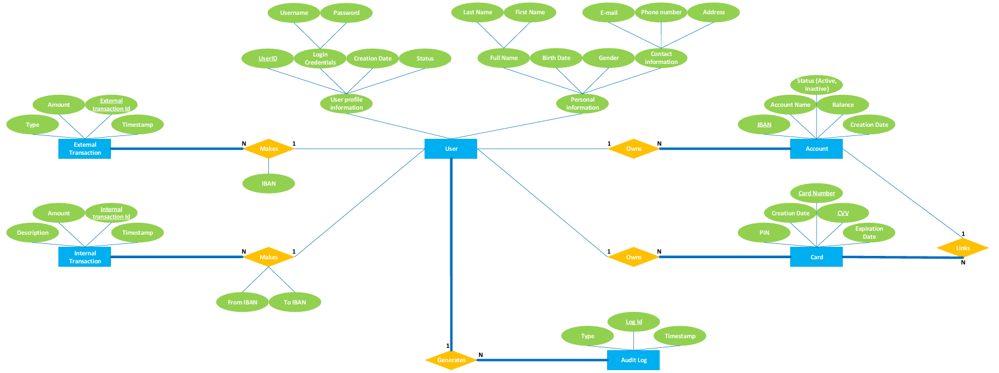
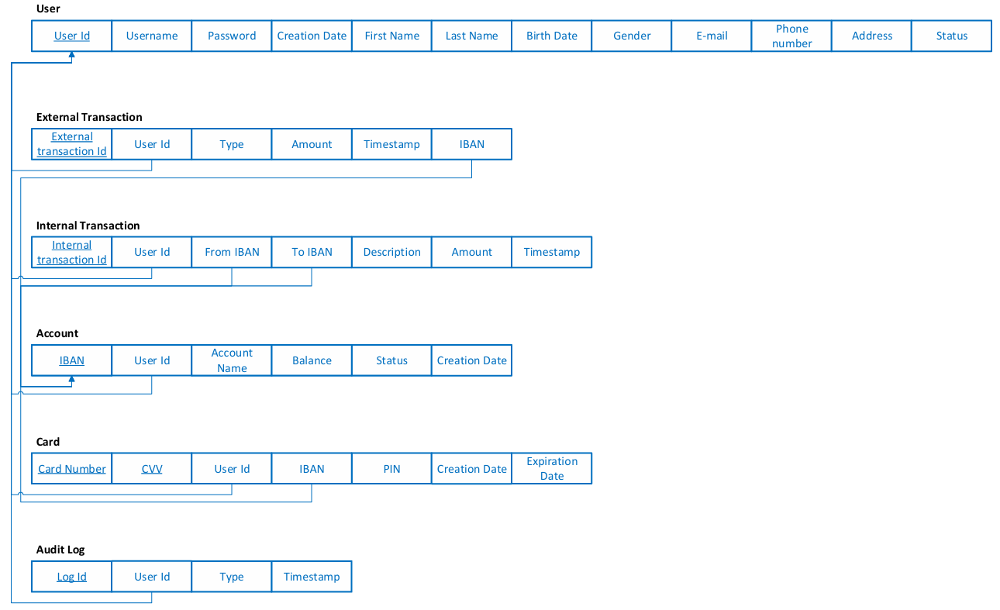
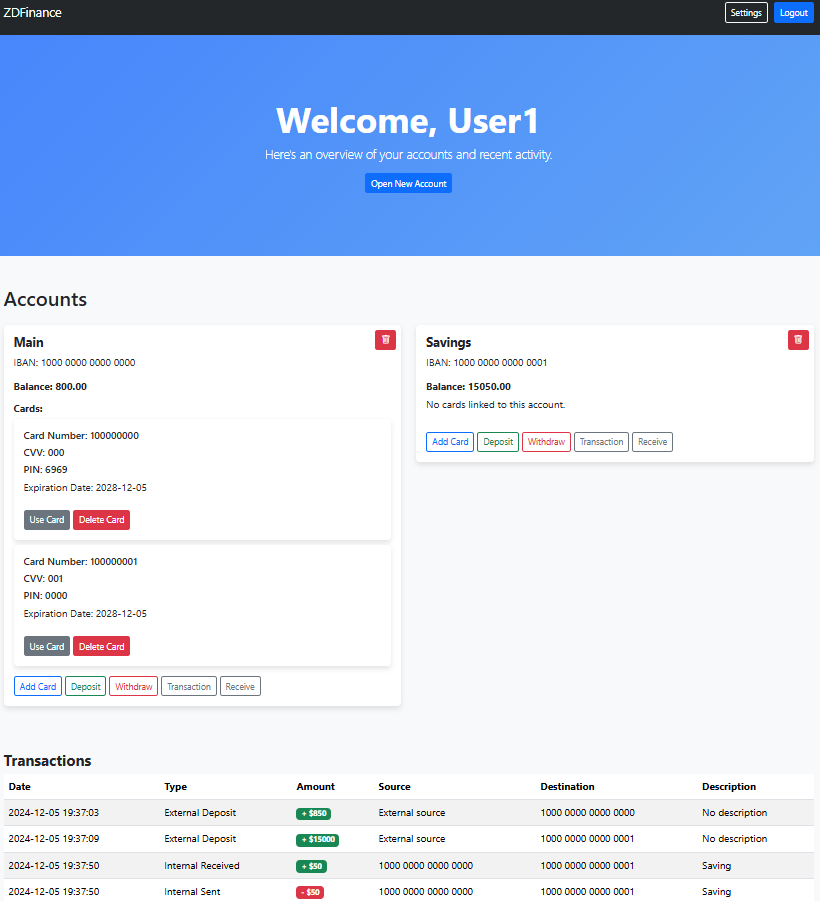
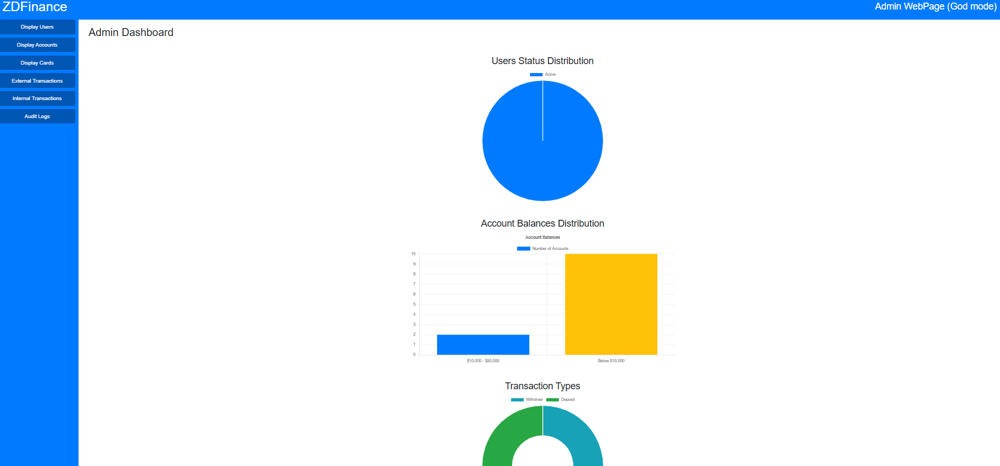
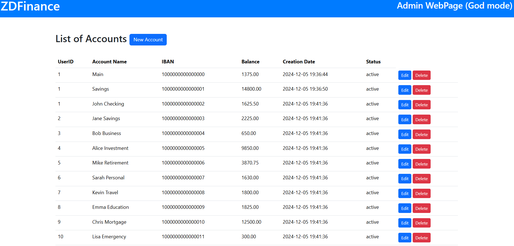
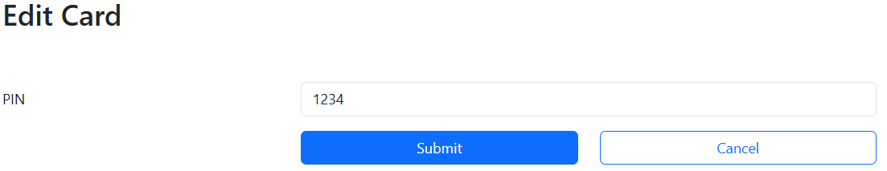

# ZDFinance

This is a project in the context of "Database Management Systems ΙΙ" of university of Thessaly.

This project is a simple simulation of a decentralized financial system.

A decentralized financial system (DeFi) operates without intermediaries like banks, using blockchain technology to facilitate peer-to-peer transactions. It provides financial services such as lending, borrowing, and trading through smart contracts, ensuring transparency and security. DeFi aims to create an open and inclusive financial ecosystem accessible to anyone with an internet connection.

This specific project does not actually inlcude the special features of a DeFi system such as actual transaction encryption but, as mentioned, is a simulation of such an intangible banking system.

## General Info

This webapp is made mostly using php, as wanted by the class we study in university, but also embedded html, css, javascript code. These languages make up the front and back end of the app in client side whereas for server side, XAMPP stack ("cross-platform", Apache, MySQL, PHP, Perl) is being used. The database is being managed using MySQL.

## Database Architecture

As forementioned, this project is in the context of a DBMS class, so it is crucial to first and foremost talk about the database implementation.

The database consists of the following tables:

* __Users__: The actual users of the app.
* __Accounts__: A user may have many accounts under his username. A similar functionality of a real materialistic bank is the existence of different types of account, such as a savings account, family account etc, one or many.
* __Cards__: Such as a real bank, under an account a user may have one or many cards associated to that account.
* __External Transactions__: Any transactions not associated with different accounts, deposits, withdrawals.
* __Internal Transactions__: Any transaction associated with money transfering between accounts.
* __Audit Log__: A special table to keep track of any actions are being made by anyone in the app. Special previleges are required to have access to the data of this table.

Obviously the tables do not have simple fields with no constrains, a lot of fields are associated between each other and checking for correct data form is being made not only in front end, but also backend and in the actual database for increased security.

Apart from the tables, the most functionalities take place in the database. The DB consists of triggers for many purposes such as checking limits of age, correct form of input etc but also many triggers to insert new records to the audit log table fast and securely after each action takes place. Finally, there also exist some procedures to help with insertion in audit log table with action such as login and logout that do not modify somehow another table in order to use a trigger.

The following images show visually the database architecture in the form of an ERD and a relational diagram:



- **Entities**: Represented by blue rectangles.  
- **Attributes**: Represented by green ellipses.  
- **Relationships**: Represented by orange diamonds.  

- All **Users** share the same attributes, some of which are composite.  
- A **User** can have multiple **Accounts** in a **1:N partial-to-total relationship**, as opening an account is optional.  
- The same relationship applies between **Accounts** and **Cards**, as well as between **Users** and **Transactions** (internal and external).  
- A **1:N total-to-total relationship** exists between **Users** and **Audit logs**.



- **Tables**: Represented by groups of rectangles.  
- **Primary Keys**: Represented by underlined data within a table.  
- **Foreign Keys**: Represented by arrows pointing from one piece of data to another.  

### Normalization and Database Design  
After creating the relational schema, normalization is required to ensure efficient database functionality. Normalization applies design rules to prevent **data redundancy** and **update anomalies** before implementation.  

#### Third Normal Form (3NF)  
3NF is a normalization level following 1NF and 2NF. The conditions for 3NF are:  
1. **1NF**:  
   - No duplicate records.  
   - No multivalued data in a single cell.  
   - No data that can be further decomposed into smaller cells.  
2. **2NF**:  
   - Must already be in 1NF.  
   - No partial dependencies (dependencies on part of a composite primary key).  
3. **No Transitive Dependencies**:  
   - All fields must depend only on the primary key.  


## The Codebase

The client side of this webapp consists of two main parts, the user and the admin. The users webpage is for anyone that wants to simply use the app whereas the admin page is, as the name states, for the admin.

### User Webpage

As in any other e-banking webapp, the central webpage of the user is info about the company, FAQs and general info. There, obviously, exist the buttons with pop up forms for login and sign up (AKA user creation). When a user logs in or signs up for the first time, he sees his personal info about the e-banking system, his accounts and all cards associated to them, all the transactions he has made. It is important to note that on sign up for security reasons, the password is being hashed. User also in the same page may do actions like make transactions with a third person, make his device act like a POS system, generating a QR code whereas the third person scans using one of his cards and send the amount of money the QR says. After the transaction, the user sending money dynamically sees the amount of the specific account lower due to sending money and the user receiving money sees the opposite for the selected account. The transaction log for each user is being dynamically displayed on the bottom of the page with all the necessary information. Also, the user may create or delete accounts and cards by a very friendly UI and also change his information on the database. Finally, user even has the ability to create a new password if he forgets the old one by the "forgot" password button which sends an email to his associated email address with a unique token taking him to a special page to enter a new password and regain access to his app account.

An example image of the central users page is being displayed below after login action:



### Admin Webpage

The admin is the special app user that has privilages to see everything in the database. CEOs, CFOs etc positions in the company have admin previlages. The admin, when accesses his webpage, firstly sees some charts with statitics about the database to help him have a quick overview of how things go with the users in the database. The admin also has a sidebar with buttons to have access to the data of all tables of the database. This special user, ashe is  the admin, has the power to make some logical changes. He can change information about users, accounts, cards, create new ones, or even delete them if a user does not follow the companys guidelines. But there are things that, even the admin, cannot do. Examples of such actions is the modification or deletion of transactions. The admin may see all transactions made in the databse or the audit log but it is illigal for him to do such actions as there could be a lot of law mix ups.

A functionality implemented about the deletion of users and account is just them being "displayed" (status "deleted"/"inactive"). The user cannot anymore access his personal app account or cannot see his own accounts in the app as the status of them is "deleted"/"inactive". This due to reason that it is important for the company to keep such information, even if the user is not being accessed for future modification if active again.

An example set image of the admins page with some actions is being displayed below:





## Programming Implementaion

This app, as mentioned, due to the necessities of the class is being implemented mostly in php.

### PHP

PHP (Hypertext Preprocessor) (org. Personal Home Page) is a widely-used, open-source scripting language primarily designed for web development. It is embedded within HTML, making it ideal for creating dynamic and interactive websites. PHP executes on the server side, enabling tasks like handling forms, managing databases, session tracking, and generating dynamic page content. Its compatibility with various databases, such as MySQL, PostgreSQL, and SQLite, makes it a popular choice for developing data-driven web applications. PHP powers a significant portion of the web, including platforms like WordPress, and is valued for its simplicity, flexibility, and extensive library of built-in functions.

### MySQL

MySQL is one of many SQL products out there and it was chosen for this project due to its easy and big compatibility with php via XAMPP stack.

### Other Tools

HTML, CSS, JS have been used for GUI purposes.

## How to install

As mentioned, this app is implemented on top of XAMPP stack so is vital to have installed XAMPP in order to use and make modifications (since right now it is not being hosted on a cloud server with a real address name given by some DNS) and paste the codebase inside `htdocs` directory inside xampp directory created after installation. User has to access the `/apache/conf/httpd.conf` file inside xampp directory he created after installing and change the following:

Change the `Require local` to `Require all granted` in order to have access to the server PC from different machines other than the host if connected to the same network.

User may also have *composer* installed. He may type:
```cmd
composer install
```
to create all necessary files in the host machine.

Finally, in order to have access via browser to access the QR transaction system, any users do have to access the host machine (the one running the server) via its IP address with `HTTPS://` in the beginning. For example, if I run the server and have an IPv4 of `192.168.1.1`, the user that wants to use the webapp and have the QR feature, if connected in the same network, has to type in the browser:

```
https://192.168.1.1/ZDFinance/user/pages/boot.html
```

To access the admin webpage, the address is:

```
192.168.1.1/ZDFinance/admin/index.html
```

note how `https` is not crucial for the admin.

The host may access anything also by using `localhost/` instead of `<IP>/`.

After accessing one of these two webpages user doesn't need to manually type any other address. All other pages are being dynamiclly and automatically being routed via the GUI.

## Sources

A list of sources used for this project is being displayed below:

*   MySQL Documentation
*   MySQL Manual
*   PHP Documentation
*   PHP Manual
*   YouTube
*   ChatGPT